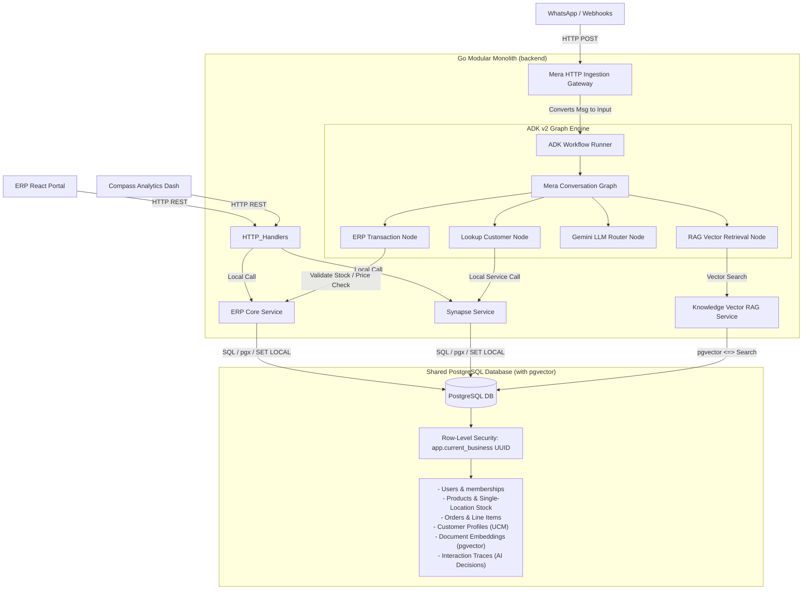
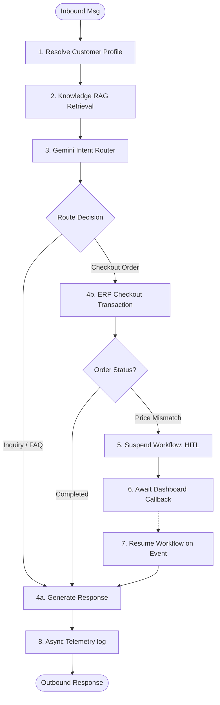

# Meridien Engine — Architecture Specification (v2.0)

**Version:** 2.0 (Phase 5 — Unified Platform, Mera & Synapse)  
**Last updated:** July 2026  
**Status:** Unified Reference / Publication Ready  

This document serves as the unified technical specification and single source of truth for the **Meridien Engine**, a next-generation multi-tenant enterprise retail, customer relationship (Synapse), and conversational AI platform (Mera).

---

## 1. System Overview & Component Mapping

Meridien Engine is structured as a **Modular Monolith in Go**, allowing simple deployment profiles, high-performance local function calls, and compile-time type safety. It separates high-performance transactional logic (ERP) from customer memory (Synapse) and autonomous execution (Mera).



### Module Subsystems
*   **ERP Service**: Manages inventory stock counts (single-location model) and catalog details, executing checkout settlements.
*   **Synapse Service**: Maintains the Unified Customer Model (UCM), tracking customer communication channels (WhatsApp IDs) and generating customer histories.
*   **Knowledge Service**: Implements pgvector semantic search and structured document ingestion.
*   **Mera Engine**: Houses the autonomous ReAct conversation graph and human-in-the-loop (HITL) suspension controllers.

---

## 2. Multi-Tenancy & Security Guardrails

### Row-Level Security (RLS)
Data isolation is enforced at the PostgreSQL database layer using Row-Level Security. Every database table (excluding global `users`) has a `business_id UUID` column and an active RLS policy:
```sql
CREATE POLICY tenant_isolation ON products 
  USING (business_id = current_setting('app.current_business', true)::uuid);
```
In Go, database operations propagate the tenant UUID via `context.Context` and execute within a transaction wrapper that sets the local session variable before calling SQL queries:
```go
// repository.ExecuteWithinTenant wrapper
_, err := tx.ExecContext(ctx, "SET LOCAL app.current_business = $1", businessID)
```

### Zero-Hallucination Pricing Guardrail
To ensure the AI agent (Mera) cannot commit illegal pricing, the agent has **no ability to overwrite or dictate prices**.
1. Mera's Graph requests checkouts by submitting only the product `SKU` and `quantity`.
2. The ERP checkout engine queries the database catalog to resolve the true price.
3. If the user expects a different price than the database catalog, the transaction status is marked as `pending_review` and workflow execution is suspended for manual operator approval.

---

## 3. Mera Conversation Graph & HITL Engine

Mera uses the **Google Agent Development Kit (ADK) v2** (`google.golang.org/adk/v2`) to structure agent behavior as a deterministic directed graph.



### Human-in-the-Loop (HITL) Suspend Timeout & Escalation
Workflows suspended on price mismatches or operational exceptions have an automatic expiration TTL monitored by a background daemon (`hitl.Checker`):
*   **Default Timeout**: 24 hours (configurable via `HITL_TIMEOUT_HOURS`).
*   **Two-Tier Escalation Policy**:
    *   **Tier 1 (T+24h)**: Background daemon generates a warning notification to the merchant dashboard.
    *   **Tier 2 (T+36h)**: Background daemon auto-rejects the suspended workflow, updates status to `timed_out`, and triggers a callback resuming the runner in the rejected branch.

---

## 4. Knowledge Engine (RAG) & Semantic Chunking

Ingesting manuals, return policies, and FAQ sheets utilizes an advanced chunking strategy to optimize vector retrieval.

### LLM-Based Semantic Chunking (Gemini)
Traditional character-count splitters break sentences mid-thought. Meridien Engine implements **LLM-Based Semantic Chunking** using `gemini-2.5-flash` at ingestion time:
1. The raw text is passed to Gemini with a structured system prompt requesting splits along semantic shifts and topic transitions.
2. The model returns a strict JSON array of strings `[]string` representing coherent segments.
3. The segments are passed to the embedding API and saved to pgvector.

### Naive Overlapping Fallback
To safeguard ingestion against network dropouts or LLM limits, a naive overlapping splitter acts as an automatic fallback:
```go
// Fallback triggered if semanticChunkText returns an error
chunks = chunkText(req.Content, 512, 64)
```

---

## 5. Observability & Telemetry

### Operational Metrics (Prometheus)
A dedicated metrics registry ([backend/internal/metrics/metrics.go](file:///media/muhammad/FS/2026/meridien-engine/backend/internal/metrics/metrics.go)) exposes standard Prometheus metrics at `/metrics`:
*   `AgentTurnsTotal` / `AgentLatency`: Conversation execution tracking.
*   `LLMTokensUsed`: Inbound and outbound token consumption.
*   `RAGQueryDuration` / `RAGChunksReturned`: Vector database retrieval tracking.

### Tracing (OpenTelemetry & Tempo)
Every ADK workflow node runs wrapped with OpenTelemetry spans (`withTrace`), propagating the active `business_id` metadata. This allows developers to trace conversational execution graphs from webhooks down to the database query level inside Grafana Tempo:
```go
ctx, span := otel.Tracer("mera").Start(ctx, "node.rag_retrieval")
```
Required trace nodes: `mera.resolve_customer`, `mera.rag_retrieval`, `mera.erp_checkout`, `mera.llm_route`, `mera.hitl_suspend`.

---

## 6. Authentication Flows

Meridien Engine utilizes a **two-token JWT authentication flow** to isolate global identities from active business sessions.

```text
[Registration/Login]
1. POST /auth/register    → Register generic credentials
2. POST /auth/login       → Return generic JWT { user_id, type: "generic" }

[Session Scoping]
3. GET  /auth/businesses  → Retrieve businesses where user has membership
4. POST /auth/use-business/:id 
                          → Verify permissions
                          → Return scoped JWT { user_id, business_id, role, type: "scoped" }

[Application Scope]
5. API Handlers           → Accept ONLY scoped JWT
```
*   **gRPC Handlers**: Use a server unary interceptor (`TenantInterceptor`) extracting metadata credentials and injecting them into the context via `repository.WithBusinessID`.

---

## 7. Supplemental Material
*   For request payloads, response signatures, and gRPC service message contracts, see [docs/API.md](file:///media/muhammad/FS/2026/meridien-engine/docs/API.md).
*   For engineering dependencies, mathematical formulas, and external research repositories, see [docs/REFERENCES.md](file:///media/muhammad/FS/2026/meridien-engine/docs/REFERENCES.md).

