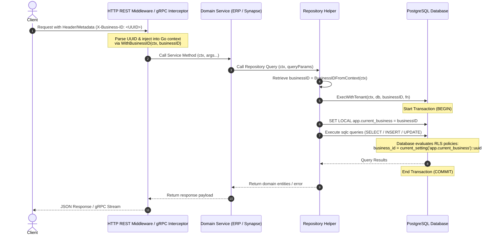
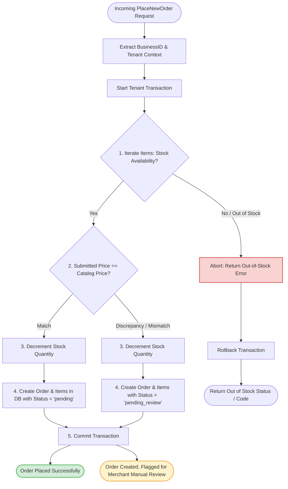
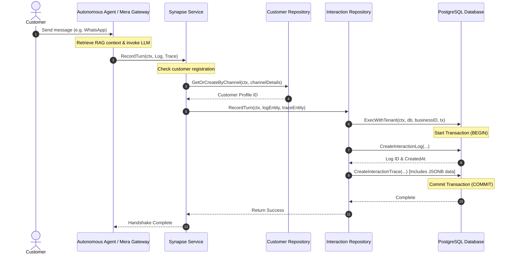
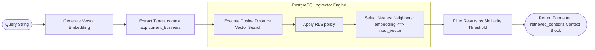

# System Flow Scenarios & Runtime Logic

This document details the primary runtime scenarios, request flows, and architectural invariants of the **Meridien Engine** modular monolith. It provides sequence and logic flows using Mermaid diagrams to illustrate how multi-tenancy, transactional safety, and contextual tracing are enforced across the services.

---

## 1. Multi-Tenant Context Propagation & Request Lifecycle

To guarantee absolute isolation between merchants, tenant identification is extracted at the entry points (HTTP/gRPC) and propagated through the application layers down to the database session context.

### Sequence Flow

### Key Components:
* **Context Setter/Getter**: [tenant.go](file:///media/muhammad/FS/2026/meridien-engine/backend/internal/repository/tenant.go) implements [WithBusinessID](file:///media/muhammad/FS/2026/meridien-engine/backend/internal/repository/tenant.go#L16) and [BusinessIDFromContext](file:///media/muhammad/FS/2026/meridien-engine/backend/internal/repository/tenant.go#L23).
* **Database Session Binding**: [ExecWithTenant](file:///media/muhammad/FS/2026/meridien-engine/backend/internal/repository/tenant.go#L43) wraps transactions, explicitly invoking `SET LOCAL app.current_business` to activate database Row-Level Security (RLS).

---

## 2. Order Placement & Integrity Verification Flow (ERP)

All orders (whether placed via the Merchant Portal or generated autonomously by the AI agent) must pass through the **ERP Order Verification Layer** to enforce inventory constraints and flag pricing anomalies.

### Flow Logic

### Key Components:
* **gRPC Endpoint**: [PlaceNewOrder](file:///media/muhammad/FS/2026/meridien-engine/backend/internal/grpchandler/order_handler.go#L33) in [order_handler.go](file:///media/muhammad/FS/2026/meridien-engine/backend/internal/grpchandler/order_handler.go).
* **Core Logic**: [PlaceOrder](file:///media/muhammad/FS/2026/meridien-engine/backend/internal/erp/service.go#L33) in [service.go](file:///media/muhammad/FS/2026/meridien-engine/backend/internal/erp/service.go).
* **Inventory Control**: [DecrementStock](file:///media/muhammad/FS/2026/meridien-engine/backend/internal/repository/product.go#L74) in [product.go](file:///media/muhammad/FS/2026/meridien-engine/backend/internal/repository/product.go).

---

## 3. Customer Interaction Log & Trace Flow (Synapse)

When the autonomous agent interacts with a customer, the conversational turns and underlying agent thoughts (including retrieved RAG contexts and tool execution histories) are durably recorded in the Synapse database schema.

### Sequence Flow

### Key Components:
* **Domain Service**: [RecordTurn](file:///media/muhammad/FS/2026/meridien-engine/backend/internal/synapse/service.go#L41) in [service.go](file:///media/muhammad/FS/2026/meridien-engine/backend/internal/synapse/service.go).
* **Repository Storage**: [RecordTurn](file:///media/muhammad/FS/2026/meridien-engine/backend/internal/repository/interaction.go#L27) in [interaction.go](file:///media/muhammad/FS/2026/meridien-engine/backend/internal/repository/interaction.go).

---

## 4. Vector Search & RAG Query Flow (Knowledge)

To keep conversational search latency minimal and decoupled from database lock states, Knowledge base search operations query vector embeddings directly using pgvector similarity metrics.

### Flow Logic

### Key Components:
* **gRPC Endpoint**: [QueryKnowledge](file:///media/muhammad/FS/2026/meridien-engine/backend/internal/grpchandler/knowledge_handler.go#L32) in [knowledge_handler.go](file:///media/muhammad/FS/2026/meridien-engine/backend/internal/grpchandler/knowledge_handler.go).
* **pgvector Queries**: [Query](file:///media/muhammad/FS/2026/meridien-engine/backend/internal/repository/knowledge.go#L27) in [knowledge.go](file:///media/muhammad/FS/2026/meridien-engine/backend/internal/repository/knowledge.go).
