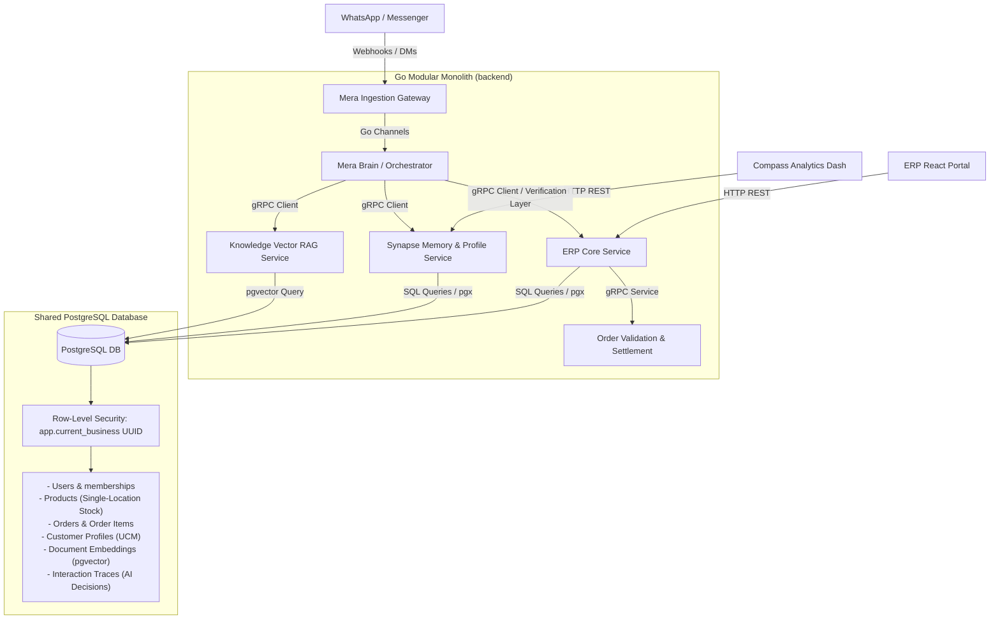
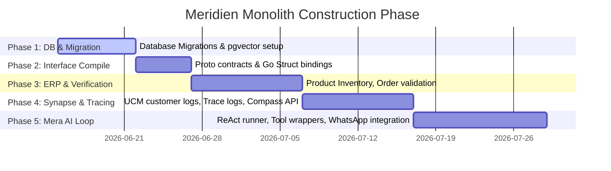

# **Meridien Engine: Master Implementation & Observability Blueprint**

This document serves as the unified technical specification and development blueprint for the **Meridien Engine**, a next-generation multi-tenant enterprise retail and inventory intelligence platform. 

It consolidates previous unstructured blueprints and incorporates concrete design decisions reached during our architecture session.

---

## **1. System Architecture & Component Mapping**

Meridien Engine is built as a **Modular Monolith in Go**, optimizing runtime performance, system simplicity, and type safety. It separates high-performance transactional logic (ERP) from contextual intelligence (Synapse) and autonomous execution (Mera).



---

## **2. Core Strategic & Technical Goals**

### **Goal 1: Bulletproof Multi-Tenant Isolation**
* **Objective:** Prevent any cross-merchant data leakage at the database layer.
* **Mechanism:** Enforce PostgreSQL **Row-Level Security (RLS)** using `app.current_business` as a **UUID** token. Every transactional query from the Go services must set this session variable inside the database transaction context.
* **Scope:** All operational tables (products, orders, customer profiles, vector embeddings, and traces) are strictly RLS-enabled.

### **Goal 2: Agent Integrity & Anti-Hallucination Guardrails**
* **Objective:** Guarantee that the autonomous voice (Mera) cannot commit illegal pricing, sell out-of-stock items, or violate tenant-specific boundaries.
* **Mechanism:** 
  * Orders placed by the AI pass through the **ERP Order Verification Layer**.
  * **Stock Check:** Real-time stock validation rejects orders for out-of-stock SKUs.
  * **Price Validation:** If the AI-submitted price does not match the database catalog price, the order is **flagged** and saved with `status = 'pending_review'` for manual merchant approval rather than failing the transaction outright or committing a discounted sale without permission.

### **Goal 3: Semantic Isolation & Performance (Fault Independence)**
* **Objective:** Keep customer interaction processing live and conversational even during ERP batch operations or momentary transactional locks.
* **Mechanism:** Knowledge Base vector queries run against the `pgvector` store using the tenant's cache. General FAQs, catalogs, and return policies do not require transaction-blocking locks.

---

## **3. Database Schema Expansion**

Building on the existing [000001_core_foundation.up.sql](file:///media/muhammad/FS/2026/meridien-engine/backend/db/migrations/000001_core_foundation.up.sql), we expand the database schema with the following design choices.

### **A. Single-Location Inventory Schema**
As decided, inventory is modeled as single-location per tenant, with stock counts directly on the products table.

```sql
-- ── Products Table ──
CREATE TABLE products (
  id            UUID          PRIMARY KEY DEFAULT uuid_generate_v4(),
  business_id   UUID          NOT NULL REFERENCES businesses(id),
  sku           VARCHAR(100)  NOT NULL,
  name          VARCHAR(255)  NOT NULL,
  description   TEXT,
  price         NUMERIC(12,2) NOT NULL,
  stock_qty     INT           NOT NULL DEFAULT 0,
  created_at    TIMESTAMPTZ   NOT NULL DEFAULT NOW(),
  updated_at    TIMESTAMPTZ   NOT NULL DEFAULT NOW(),

  CONSTRAINT products_sku_unique UNIQUE (business_id, sku),
  CONSTRAINT products_price_check CHECK (price >= 0),
  CONSTRAINT products_stock_check CHECK (stock_qty >= 0)
);

CREATE INDEX idx_products_sku ON products(business_id, sku);
ALTER TABLE products ENABLE ROW LEVEL SECURITY;
CREATE POLICY products_isolation ON products USING (business_id = current_setting('app.current_business', true)::uuid);
ALTER TABLE products FORCE ROW LEVEL SECURITY;
```

### **B. Orders & Validation Status Schema**
```sql
-- ── Orders Table ──
CREATE TABLE orders (
  id            UUID          PRIMARY KEY DEFAULT uuid_generate_v4(),
  business_id   UUID          NOT NULL REFERENCES businesses(id),
  customer_id   UUID          NOT NULL, -- References customer_profiles(id)
  total_price   NUMERIC(12,2) NOT NULL,
  status        VARCHAR(50)   NOT NULL DEFAULT 'pending', -- 'pending', 'pending_review', 'completed', 'cancelled'
  created_at    TIMESTAMPTZ   NOT NULL DEFAULT NOW(),
  updated_at    TIMESTAMPTZ   NOT NULL DEFAULT NOW(),

  CONSTRAINT orders_status_check CHECK (status IN ('pending', 'pending_review', 'completed', 'cancelled'))
);

-- ── Order Line Items Table ──
CREATE TABLE order_items (
  id               UUID          PRIMARY KEY DEFAULT uuid_generate_v4(),
  order_id         UUID          NOT NULL REFERENCES orders(id) ON DELETE CASCADE,
  product_id       UUID          NOT NULL REFERENCES products(id),
  sku              VARCHAR(100)  NOT NULL,
  quantity         INT           NOT NULL,
  unit_price       NUMERIC(12,2) NOT NULL, -- Catalog price
  submitted_price  NUMERIC(12,2) NOT NULL, -- Price sent by AI Agent
  
  CONSTRAINT items_quantity_check CHECK (quantity > 0)
);

ALTER TABLE orders ENABLE ROW LEVEL SECURITY;
CREATE POLICY orders_isolation ON orders USING (business_id = current_setting('app.current_business', true)::uuid);
ALTER TABLE orders FORCE ROW LEVEL SECURITY;

ALTER TABLE order_items ENABLE ROW LEVEL SECURITY;
-- order_items inherits isolation implicitly by joining order_id to orders, 
-- but we enforce it explicitly via business_id tracking if needed, or by joining:
CREATE POLICY order_items_isolation ON order_items 
  USING (EXISTS (SELECT 1 FROM orders WHERE orders.id = order_items.order_id));
ALTER TABLE order_items FORCE ROW LEVEL SECURITY;
```

### **C. Synapse: Unified Customer Model (UCM) & Communication Channels**
```sql
-- ── Customer Profiles (UCM) ──
CREATE TABLE customer_profiles (
  id               UUID          PRIMARY KEY DEFAULT uuid_generate_v4(),
  business_id      UUID          NOT NULL REFERENCES businesses(id),
  unified_name     VARCHAR(255),
  customer_tier    VARCHAR(50)   NOT NULL DEFAULT 'standard', -- 'standard', 'silver', 'gold'
  semantic_summary TEXT,          -- Evolving context generated by Synapse LLM summarizers
  created_at       TIMESTAMPTZ   NOT NULL DEFAULT NOW(),
  updated_at       TIMESTAMPTZ   NOT NULL DEFAULT NOW(),
  
  CONSTRAINT customer_tier_check CHECK (customer_tier IN ('standard', 'silver', 'gold'))
);

-- ── Communication Channels mapping (WhatsApp/Messenger IDs) ──
CREATE TABLE customer_channels (
  id                  UUID         PRIMARY KEY DEFAULT uuid_generate_v4(),
  customer_profile_id UUID         NOT NULL REFERENCES customer_profiles(id) ON DELETE CASCADE,
  channel_type        VARCHAR(50)  NOT NULL, -- 'whatsapp', 'messenger', 'web'
  channel_external_id VARCHAR(255) NOT NULL, -- Phone number or Facebook user ID
  created_at          TIMESTAMPTZ  NOT NULL DEFAULT NOW(),
  
  CONSTRAINT channel_external_unique UNIQUE (customer_profile_id, channel_type, channel_external_id)
);

ALTER TABLE customer_profiles ENABLE ROW LEVEL SECURITY;
CREATE POLICY customer_profiles_isolation ON customer_profiles USING (business_id = current_setting('app.current_business', true)::uuid);
ALTER TABLE customer_profiles FORCE ROW LEVEL SECURITY;
```

### **D. Knowledge Base: Multi-Tenant pgvector RAG**
```sql
-- Enable pgvector extension (assumes preinstalled on Postgres image)
CREATE EXTENSION IF NOT EXISTS vector;

-- ── Document Nodes Table ──
CREATE TABLE knowledge_nodes (
  id            UUID         PRIMARY KEY DEFAULT uuid_generate_v4(),
  business_id   UUID         NOT NULL REFERENCES businesses(id),
  source_name   VARCHAR(255) NOT NULL, -- PDF name or Manual Title
  content       TEXT         NOT NULL,
  embedding     vector(1536) NOT NULL, -- OpenAI text-embedding-3-small dimensions
  created_at    TIMESTAMPTZ  NOT NULL DEFAULT NOW()
);

ALTER TABLE knowledge_nodes ENABLE ROW LEVEL SECURITY;
CREATE POLICY knowledge_nodes_isolation ON knowledge_nodes USING (business_id = current_setting('app.current_business', true)::uuid);
ALTER TABLE knowledge_nodes FORCE ROW LEVEL SECURITY;
```

---

## **4. Observability & Transparency Architecture**

To achieve our observability and transparency goals, we implement two distinct diagnostic pipelines: **AI Reasoning Tracing** and **Operational Monitoring**.

### **A. AI Reasoning Traces (PostgreSQL Storage)**
As decided, we store the full reasoning process inside the Postgres instance. This powers the **Compass Analytics Dashboard** directly, allowing merchants to see *why* Mera responded the way she did.

```sql
-- ── Interaction Logs (Structural Metadata) ──
CREATE TABLE interaction_logs (
  id               UUID         PRIMARY KEY DEFAULT uuid_generate_v4(),
  business_id      UUID         NOT NULL REFERENCES businesses(id),
  customer_id      UUID         NOT NULL REFERENCES customer_profiles(id),
  channel          VARCHAR(50)  NOT NULL, -- 'whatsapp', 'web'
  inbound_msg      TEXT         NOT NULL,
  outbound_msg     TEXT         NOT NULL,
  tokens_used      INT          NOT NULL DEFAULT 0,
  latency_ms       INT          NOT NULL DEFAULT 0,
  created_at       TIMESTAMPTZ  NOT NULL DEFAULT NOW()
);

-- ── Interaction Traces (Deep AI Debugging Detail) ──
CREATE TABLE interaction_traces (
  id                 UUID         PRIMARY KEY DEFAULT uuid_generate_v4(),
  interaction_log_id UUID         NOT NULL REFERENCES interaction_logs(id) ON DELETE CASCADE,
  retrieved_contexts JSONB        NOT NULL, -- Array of matching knowledge base strings & match scores
  system_prompt      TEXT         NOT NULL, -- The exact template injected
  raw_agent_thoughts TEXT         NOT NULL, -- LLM raw outputs (thought chains, tool invocations)
  tools_called       JSONB        NOT NULL, -- List of gRPC tools triggered by Mera
  created_at         TIMESTAMPTZ  NOT NULL DEFAULT NOW()
);

ALTER TABLE interaction_logs ENABLE ROW LEVEL SECURITY;
CREATE POLICY interaction_logs_isolation ON interaction_logs USING (business_id = current_setting('app.current_business', true)::uuid);
ALTER TABLE interaction_logs FORCE ROW LEVEL SECURITY;

ALTER TABLE interaction_traces ENABLE ROW LEVEL SECURITY;
CREATE POLICY interaction_traces_isolation ON interaction_traces 
  USING (EXISTS (SELECT 1 FROM interaction_logs WHERE interaction_logs.id = interaction_traces.interaction_log_id));
ALTER TABLE interaction_traces FORCE ROW LEVEL SECURITY;
```

### **B. System Operational Observability Goals**
1. **Audit Logs:** Every status change, manual price override, and configuration update is logged as an immutable entry in the system audit logs (see existing `audit_logs` schema).
2. **Performance Metrics:** Implement OpenTelemetry Go SDK to track:
   * gRPC request duration metrics.
   * RAG Vector search latency (distinguishing database retrieval time from LLM response time).
   * LLM API token consumption rates and billing parameters.
3. **Structured Application Logging:** Zero plaintext logging for core loops. The monolithic application will output JSON formatted logs to stdout (using `uber-go/zap` or standard `slog`), ensuring log shippers can easily parse error events.

---

## **5. API Interface Contracts (gRPC)**

System boundaries communicate internally using gRPC APIs generated via compile-time protobuf bindings.

### **A. ERP Orders: `api/proto/orders.proto`**
```protobuf
syntax = "proto3";
package meridien.erp.orders;
option go_package = "internal/grpc/orders";

service OrderService {
  rpc PlaceNewOrder (OrderRequest) returns (OrderResponse);
  rpc GetOrderStatus (StatusRequest) returns (StatusResponse);
  rpc GetOrderDetails (DetailsRequest) returns (DetailsResponse);
}

message OrderRequest {
  string customer_id = 1;
  repeated OrderLineItem items = 2;
}

message OrderLineItem {
  string sku = 1;
  int32 quantity = 2;
  double submitted_unit_price = 3; // Input from AI agent
}

message OrderResponse {
  string order_id = 1;
  string status = 2; // 'pending' or 'pending_review'
  string confirmation_msg = 3;
}

message StatusRequest {
  string order_id = 1;
}

message StatusResponse {
  string order_id = 1;
  string status = 2;
  string estimated_delivery = 3;
}

message DetailsRequest {
  string order_id = 1;
}

message DetailsResponse {
  string order_id = 2;
  repeated OrderLineItem items = 3;
  double total_price = 4;
}
```

### **B. Synapse Memory & Profile: `api/proto/customer.proto`**
```protobuf
syntax = "proto3";
package meridien.synapse;
option go_package = "internal/grpc/customer";

service SynapseService {
  rpc GetCustomerProfile (ProfileRequest) returns (ProfileResponse);
  rpc RecordInteraction (InteractionRecord) returns (InteractionResponse);
}

message ProfileRequest {
  string channel_type = 1;       // "whatsapp", "messenger", "web"
  string channel_external_id = 2; // e.g. Phone number "+123456789"
}

message ProfileResponse {
  string customer_id = 1;
  string unified_name = 2;
  string customer_tier = 3;
  string semantic_summary = 4;
}

message InteractionRecord {
  string customer_id = 1;
  string channel = 2;
  string inbound_msg = 3;
  string outbound_msg = 4;
  int32 tokens_used = 5;
  int32 latency_ms = 6;
  
  // Tracing parameters for Compass
  string system_prompt = 7;
  string raw_agent_thoughts = 8;
  repeated string retrieved_context_chunks = 9;
  string tools_called_json = 10;
}

message InteractionResponse {
  string interaction_id = 1;
  bool success = 2;
}
```

---

## **6. Verification & Transaction Context Middleware**

In Go, SQL operations are routed through a database helper that transparently sets local variables inside transactions before executing domain actions. This prevents data-leaking programming errors.

```go
package repository

import (
	"context"
	"database/sql"
	"fmt"
)

// DBTx is a common interface matching *sql.Tx and transactional connections.
type DBTx interface {
	ExecContext(ctx context.Context, query string, args ...interface{}) (sql.Result, error)
}

// ExecuteWithinTenant executes a function block inside a transaction, setting the RLS scope.
func ExecuteWithinTenant(ctx context.Context, tx *sql.Tx, businessID string, fn func() error) error {
	// 1. Inject the active business context parameter
	_, err := tx.ExecContext(ctx, "SET LOCAL app.current_business = $1", businessID)
	if err != nil {
		return fmt.Errorf("failed to set RLS context: %w", err)
	}

	// 2. Run transactional query block
	if err := fn(); err != nil {
		return err
	}

	return nil
}
```

---

## **7. Phase-by-Phase Roadmap**



### **Phase 1: Database & Migration Foundation**
* Deploy SQL migrations expanding schema with products, orders, customer profiles, pgvector tables, and trace tables.
* Execute multi-tenant leak tests validating PostgreSQL RLS configurations across all tables.

### **Phase 2: Proto Compilation & Code Skeleton**
* Write protobuf definitions inside `api/proto/` and generate Go gRPC stubs.
* Hook Go gRPC servers to the monolith core.

### **Phase 3: ERP Transaction Service & Order Verification**
* Implement inventory stock deduction and catalog querying.
* Build order verification middleware: checks product availability, records orders, and auto-routes discrepancies into `pending_review` status.

### **Phase 4: Synapse Memory & AI Tracing Engine**
* Implement Synapse UCM matching layers.
* Implement interaction logging to save prompts, agent thoughts, and retrieval indexes into PostgreSQL.

### **Phase 5: Mera Reasoning Loop & Gateways**
* Set up the LangChainGo / ReAct loop execution agent wrapper.
* Connect incoming message webhooks (WhatsApp/Web) to gateway controllers.
