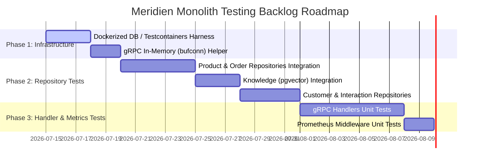

# testing_backlog.md

This document defines the Meridien Monolith backend testing roadmap, analyzing the current coverage gaps and specifying concrete integration and unit testing strategies for missing areas (repositories, gRPC handlers, and metrics).

---

## Current Coverage & Gap Analysis

As of July 2026, the codebase utilizes a filtered coverage threshold check of **60%** focusing exclusively on the core business logic services. The overall coverage stands at **73.1%** for the core packages but drops to **3.1%** for the entire project because multiple structural layers are currently untested:

| Package | Files | Coverage | Primary Reason for Low Coverage |
| :--- | :--- | :--- | :--- |
| `internal/erp` | `service.go` | **77.1%** | Core logic heavily covered with mock-based unit tests. |
| `internal/synapse` | `service.go` | **66.7%** | Core logic covered with mock-based unit tests. |
| `internal/health` | `health.go` | **72.7%** | Standard handler unit tests. |
| `internal/repository` | `customer.go`, `interaction.go`, `knowledge.go`, `order.go`, `product.go`, `tenant.go` | **1.9%** | Requires real database instances / Docker services; currently untested. |
| `internal/grpchandler` | `knowledge_handler.go`, `order_handler.go`, `synapse_handler.go` | **0.0%** | Requires gRPC client/server testing harness setup. |
| `internal/metrics` | `metrics.go` | **0.0%** | Middleware logic has no test coverage. |
| `internal/db` | Generated sqlc files | **0.0%** | Generated code (excluded from active coverage). |
| `internal/gen` | Generated proto stubs | **0.0%** | Generated code (excluded from active coverage). |

---

## Implementation Strategies for Missing Tests

### 1. Repository Layer (`internal/repository`)
* **Goal**: Verify sqlc queries, constraints, nullability, transactions, and multi-tenant schema-scoping functions correctly.
* **Strategy**: **Integration Testing**.
  * Use a real PostgreSQL instance. Local tests can run against the Docker Compose test instance, and CI uses the `pgvector/pgvector:pg16` service container.
  * Use `testcontainers-go` to dynamically spin up database and Redis instances for isolated local runs if desired, or reuse the shared test database.
* **Key Scenarios to Test**:
  * **Tenant Isolation**: Confirm that records created under `Tenant A` cannot be retrieved, updated, or listed under `Tenant B` when context tenant validation helper methods (e.g. `BusinessIDFromContext`) are utilized.
  * **Vector Search**: Verify cosine similarity queries in `knowledge.go` return relevant chunks based on vector distance embeddings.

### 2. gRPC Handler Layer (`internal/grpchandler`)
* **Goal**: Validate request mapping, gRPC metadata/context parsing (like tenant extraction), error conversion, and response structures.
* **Strategy**: **gRPC Service Mocking**.
  * Use `google.golang.org/grpc/test/bufconn` to spin up an in-memory gRPC listener.
  * Inject mock services (e.g. `mockERPService`, `mockSynapseService`) into handlers.
  * Instantiate gRPC clients over the in-memory buffer, invoke methods, and assert gRPC error codes (e.g., `codes.NotFound`, `codes.InvalidArgument`).
* **Key Scenarios to Test**:
  * Verify `PlaceNewOrder` calls the service correctly and maps internal validation errors to gRPC `InvalidArgument` status.
  * Verify tenant context is extracted from gRPC metadata (e.g., `X-Business-ID`) and forwarded to context-scoped service calls.

### 3. HTTP Metrics Middleware (`internal/metrics`)
* **Goal**: Verify Prometheus counters and histograms register path-scoped metrics correctly.
* **Strategy**: **HTTP Middleware Unit Testing**.
  * Use `net/http/httptest` recorder.
  * Call custom metrics middlewares and verify output registered in standard registry `/metrics` matches expected counter increments.

---

## Backlog Roadmap

### Prioritized Task Checklist

#### Priority 1: Repository Integration Test Harness (Target: Q3 Start)
- [ ] Implement a test helper package `internal/repository/testutil` to bootstrap database connections, apply migrations from `db/migrations`, and purge tables between runs.
- [ ] Add integration tests for `product.go` and `order.go` checking basic CRUD operations and custom numeric mapping (e.g. `decimal.Decimal`).
- [ ] Add tenant validation assertions ensuring multi-tenant isolation helpers work seamlessly on database operations.

#### Priority 2: gRPC Handlers Mock Suite (Target: Q3 Mid)
- [ ] Create mock definitions for core domain services within `internal/grpchandler` test files.
- [ ] Build basic `bufconn`-based tests for `OrderHandler` validating request decoding and error mapping logic.
- [ ] Implement metadata-extraction tests validating missing metadata rejects gRPC calls with appropriate status codes.

#### Priority 3: Vector Search & Specialized Integration (Target: Q3 End)
- [ ] Seed test vectors into the database and test search similarity thresholds inside `knowledge.go` to avoid semantic search regressions.
- [ ] Add unit tests verifying Prometheus recording rules in `internal/metrics` middleware.
